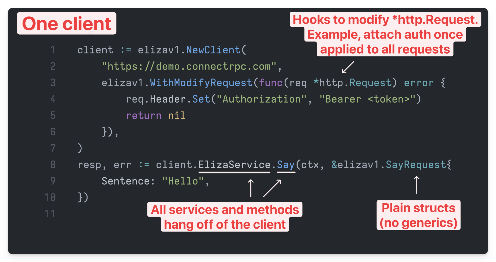

# protoc-gen-connectclient-go

A Protobuf plugin that generates a **single Connect Go client** for all services, batteries included
🔋. For more information, see the [But why?](#but-why) section.

<p align="center">
  
</p>

[Connect](https://connectrpc.com/) is a simple, yet robust, RPC framework that allows you to define
services using Protobuf and generate clients and servers in multiple languages.

This plugin MUST be generated alongside the [`protoc-gen-go`
plugin](https://pkg.go.dev/google.golang.org/protobuf/cmd/protoc-gen-go), as it relies on the
generated base types.

> [!NOTE]
>
> There's an experimental feature that uses wasm to generate the base types for the client. Which
> means this plugin is self-contained and all you need.

## Installation

```shell
go install github.com/mfridman/protoc-gen-connectclient-go@latest
```

## Examples

See the [examples](./examples) directory for a few practical examples against live Connect services.

## Plugin options

The plugin supports the following options:

| Option                                      | Default |
| ------------------------------------------- | ------- |
| [`seperate_packages`](#separate_packages)   | `false` |
| [`include_base_types`](#include_base_types) | `false` |
| [`single_file`](#single_file)               | `false` |

### `separate_packages`

When set to `true`, the plugin will generate the client into a seperate package with the `client`
suffix, importing the base types from the original package. This is useful when you want to keep the
generated code separate from the original package.

### `include_base_types`

When set to `true`, the plugin will invoke the `protoc-gen-go` plugin to generate the base types for
the client. This is an experimental feature that uses wasm to generate the base types.

(Not yet implemented)

### `single_file`

When set to `true`, the plugin will generate all code into a single file instead of splitting it up
by service.

(Not yet implemented)

## But why?

I find myself writing a lot of Go clients against Connect services, often in CLIs or other small
applications. But I don't need the full power of the official Connect library.

Here's a quick list of what this library does and does not do:

- No streaming support
- **No generics, just plain old structs**
  - Eliminates the need to wrap messages using `connect.NewRequest/Response`
- Does not generate Service-related code (very lightweight)
  - Only one runtime dependency: `google.golang.org/protobuf`
  - All generated code is self-contained
- No interceptors, just hooks for tapping into the request and response lifecycle
- No dependence on generated Connect code or `connectrpc.com/connect` library
  - Simply uses `POST` over HTTP via `http.DefaultClient` (configurable client)
- No need to maintain a separate client for each service
  - Just create a single client with `NewClient` and you're good to go, batteries included 🔋
- Provides functional options for configuring the client, allowing you to:
  - Attaching a token when creating the client, which will be used for all requests
  - Attach a logger to debug requests and responses
  - Use a custom HTTP client, such as
    [hashicorp/go-retryablehttp](https://github.com/hashicorp/go-retryablehttp)

The end goal to generate a **simple client for all your services** without writing a lot of
boilerplate code. It's not meant to be a full replacement for the official Connect plugin or
library. If you need streaming, interceptors, or other advanced features, you should use the
official library!

## Gotchas

### Errors

The generated client does not return Connect errors. If a request was sent, it will return an
`*HTTPError` and the only fields that are guaranteed to be set are `Code` (this is the HTTP status
code, 401, 404, etc.) and `Procedure` (the name of the service method that was called).

Why not `ConnectCode` or `Message`?

Connect services are typically mounted on a `net/http` router. There might be cases where the
request does not reach the RPC layer, and instead gets handled by middleware that doesn't return a
Connect error. By uniformly returning an `*HTTPError`, you can handle all errors in a consistent
manner.

```go
type HTTPError struct {
	Procedure   string
	Code        int
	ConnectCode string
	Message     string
}
```

## Status

This is a work in progress.

The plugin is functional and generates code that works. However, there are still a few things that
need to be done.

- [ ] Add tests
- [ ] Add wasm support for generating the base types
- [ ] Add method-level options, for more granular control
- [ ] Add logger support with debug and info levels
- [ ] See if there's low hanging fruit for performance improvements and the client adheres to best
      practices against Connect services
- [ ] See if it's possible to make the golden templates a reusable package, maybe one already
      exists?

## License

This project is licensed under the MIT License - see the [LICENSE](LICENSE) file for details.
